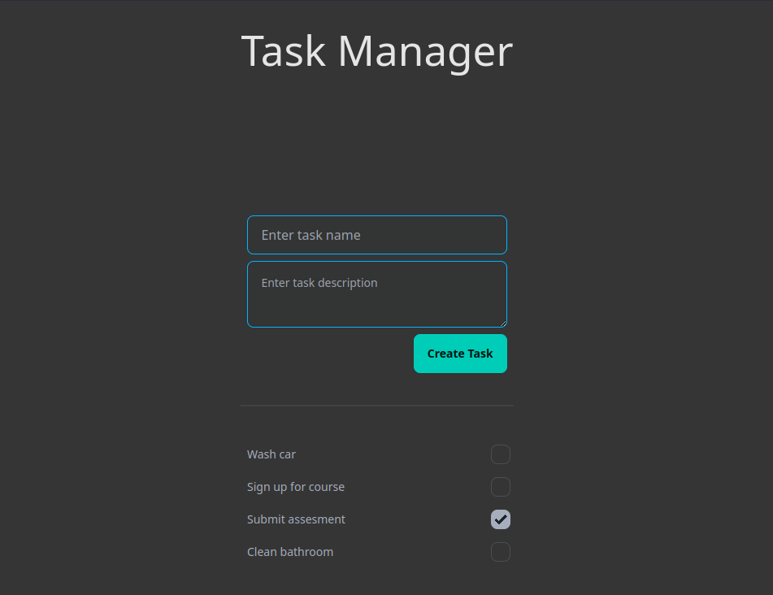

# Task Manager



A simple web application for getting stuff done.

## Getting Started

### Requirements

- Ruby (version 3.3.1)
- Bundler
- SQLite3
- Node.js

### Installation

After you clone this repo to it's desired location navigate to the project folder and install its dependencies:

For the server, `cd` into the `tasks` directory and run `bundle install`.

```
cd tasks
bundle install
```

For the web client, `cd` into the `web` directory and run `npm install`

```
cd web
npm install
```

### Start

Once the installation is complete, you can run the app by two commands in seperate terminals.

For the server, the command below from the `tasks` directory:

```
bin/rails server -p 3000
```

For the web client, the command below from the `web` directory:

```
npm run dev
```

Once those two commands have been executed, you can navigate to the url provide by the `npm run dev` command in your favorite web browser to interact with the application.